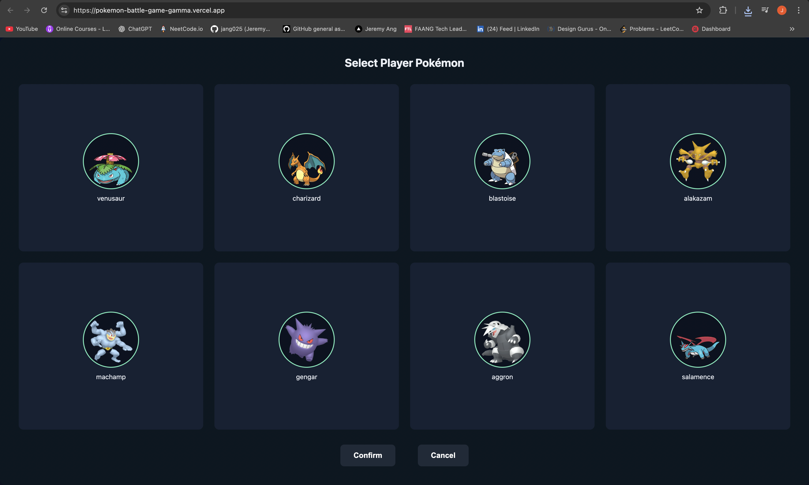
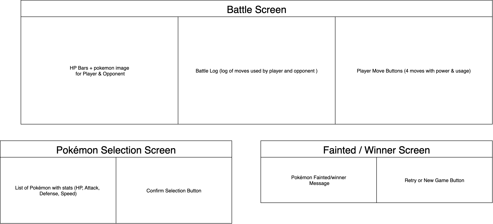
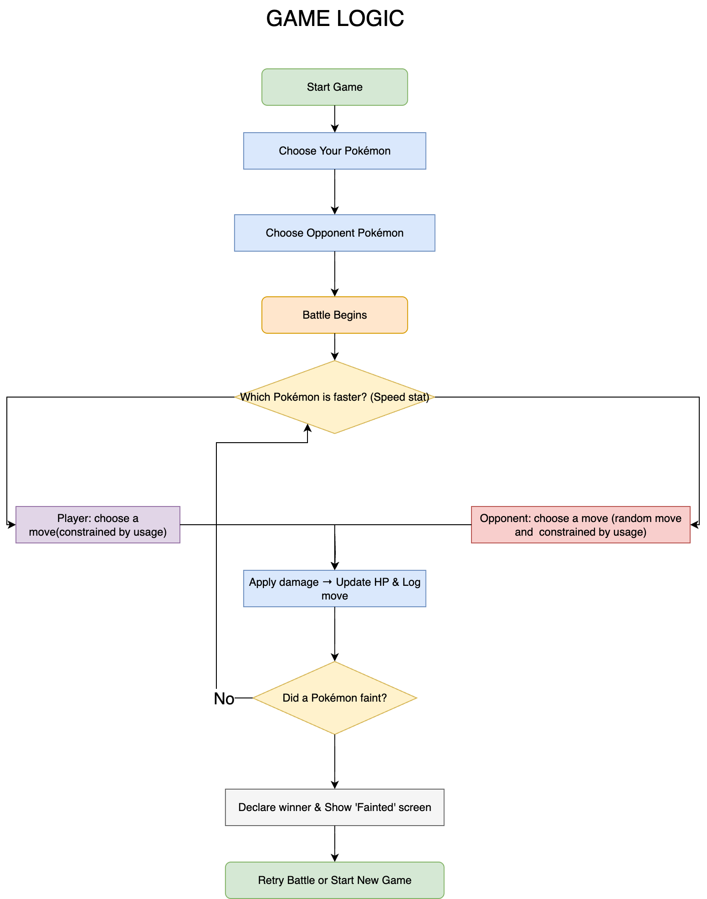

# Pokémon Battle Game

  

---

## 🎮 Game Description

Pokémon Battle Game is a browser-based mini game inspired by the classic Pokémon battle system.

Players can select a Pokémon, choose moves, and battle against a computer-controlled opponent. Each move has limited usage (PP), damage is calculated based on attack and defense, and HP bars update dynamically during the fight.

I built this project because Pokémon has always been a nostalgic favorite, and I wanted to challenge myself by recreating a simplified version of its battle mechanics using **JavaScript, HTML, and CSS**.

---

## 🚀 Getting Started

### 🔗 Live Demo

[Play the game here](https://pokemon-battle-game-gamma.vercel.app/)

### 📝 Instructions

1. Select your Pokémon and the opponent's Pokémon from the selection screen.
2. Battle begins — your Pokémon and the opponent Pokémon appear with their HP bars.
3. Choose moves by clicking the move buttons.
4. Watch as HP decreases and the battle plays out until one Pokémon faints!

### 📄 Planning Materials

- 
- 

---

## 🙌 Attributions

- Pokémon sprites and artwork © Nintendo / Game Freak (used under fair use for educational purposes).

---

## 🛠️ Technologies Used

- **HTML5**
- **CSS3**
- **JavaScript**

---

## 🔮 Next Steps (Future Enhancements)

- Display Usage and Power for each individual move on the UI.
- Include Pokémon type advantages/disadvantages for more strategic gameplay.
- Include switching out Pokémon during battle.
- Add sound effects and background music.
- Create animations for moves.
